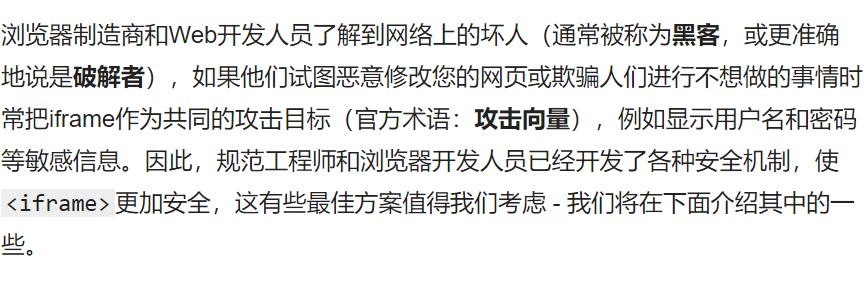

# 总结回顾17

## 学习内容

[[数组 - 学习 Web 开发 | MDN (mozilla.org)](https://developer.mozilla.org/zh-CN/docs/Learn/JavaScript/First_steps/Arrays)](https://developer.mozilla.org/zh-CN/docs/Learn/JavaScript/First_steps/What_went_wrong)

[黑马程序员JavaScript全套教程，Web前端必学的JS教程，零基础入门JavaScript_哔哩哔哩_bilibili](https://www.bilibili.com/video/BV1ux411d75J?p=96)

## 回顾所学内容

1. 应用程序接口（API）

   浏览器API:内建于web浏览器，可以将数据从周边计算机环境中筛选出来，做使用复杂的工作：1.文档对象模型DOM 2.地理位置 3.画布
   第三方API ：谷歌地图API，高德地图API

2. 编程语言

   控制计算器，让计算器为我们做事的语言。

   编程语言有：汇编语言，机器语言，高级语言

   高级语言需要一个编译器转换为计算机识别的机器语言

   编程语言是主动的有很强的逻辑性

3. 计算机基础

   数据存储

   计算机内部使用二进制0和1

   所有数据都是以二进制的形式存放在硬盘中

   硬盘、内存是保存二进制数据

   程序运行：硬盘->内存条->CPU，CPU执行内存中的代码

4. javascript的作用：实现网页交互

5. js的三种书写方式

6. 变量：一个存放数据的盒子

   * 变量的命名规范—使用驼峰命名法

   * var 和let 的区别：var允许多次声明一个相同名称的变量let不行，最好使用let：初始化后再声明变量会使代码变得混乱和难以理解

   * 变量类型

     数组类型，数据类型，object,动态类型：使用typeof返回所传递变量的数据类型。JavaScript是一种弱类型动态语言

7. 数据类型

   1. 简单数据类型：number,Boolean,String,Undefined,Null

   2. 数字类型：数字型进制二进制，八进制，十六进制，infinity，-infinity，NaN

   3. 字符串类型：

      * 字符串的长度和拼接

      * 字符串转义字符

   4. 数据类型转换

      * 转换为字符串

        | 方式               |             说明             |
        | ------------------ | :--------------------------: |
        | tostring（）       |          转为字符串          |
        | string（）强制转换 |          转为字符串          |
        | 加号拼接字符串     | 和字符串拼接的结果但是字符串 |

        

      * 转换为数字型

        | 方式               |    说明    |
        | ------------------ | :--------: |
        | parseInt（）       |  转为整数  |
        | parsefloat         | 转为浮点数 |
        | 减号，两数相减     | 转为数字型 |
        | Number（）强制转换 | 转为数字型 |

      * 转为布尔型

        Boolean()函数

8. 标识符：程序员为变量,属性，函数，参数，取得名字

9. 关键字：js本身已经使用了的字

10. 保留字：实际上是预留的关键字，最好也不要使用，未来可能成为关键字

11. 运算符

    * 算术运算符

      1. +，-,*，/ , %  

      2. 不要判断两个浮点数是否相等，浮点数值的最高精度是17位

    * 递增递减运算符

      1. 前置递增、递减运算符 先加减后赋值

         后置递增、递减运算符 先赋值 后加减

    * 比较运算符

      1. 比较两个数据，会返回一个布尔值，作为运算结构

         < ,>,>=,<=,==,!=,===,!=

      2. ==：是数值相等，数据类型可以不等，===：必须数值相等，数据类型也相等才能返回true

    * 逻辑运算符:进行布尔运算的运算符

      1. 逻辑与，逻辑或，逻辑非
      2. 短路运算原理：当多个表达式时，左边的表达式值可以确定结果时，就不再继续运算右边的表达式的值。

      3. 逻辑与短路运算，如果表达式1 为真 则返回值为表达式2，反之，则返回表达式1

         逻辑或短路运算，如果表达式1 为真 则返回值为表达式1，反之，则返回表达式2

    * 运算符优先级

      | 优先级 | 运算符                  |
      | ------ | ----------------------- |
      | 1      | 小括号（）              |
      | 2      | 一元运算符++ -- ！      |
      | 3      | 算术运算符先 * / 后 + - |
      | 4      | 关系运算符>,<,>=,<=     |
      | 5      | 相等运算符== != === !== |
      | 6      | 逻辑运算符 先&& 后 \|\| |
      | 7      | 赋值运算符 =            |
      | 8      | 逗号运算符 .            |

      一元运算符中的逻辑非 优先级最高

    12. 流程控制

        1. 分支流程 

        * if语句

        * 三元表达式

        * switch语句

        * switch语句和if else语句的区别

          * switch...case语句通常处理case为比较确定的值

            if...else语句更加灵活

          * 当分支比较少的时候，if...else语句更加高效
          * 当分支比较多时，switch语句的执行效率更高，而且结构清晰。

        2. 循环结构

           for循环：用的多一些

           断点调试：sources

           while循环：当型循环，先循环后执行

           do...while循环：直到型循环 先执行后判断

           continue和break

           1. continue关键词 退出当前次循环，继续执行后面的循环
           2. break 跳出整个循环

    ## 学习中所遇到的问题

    

