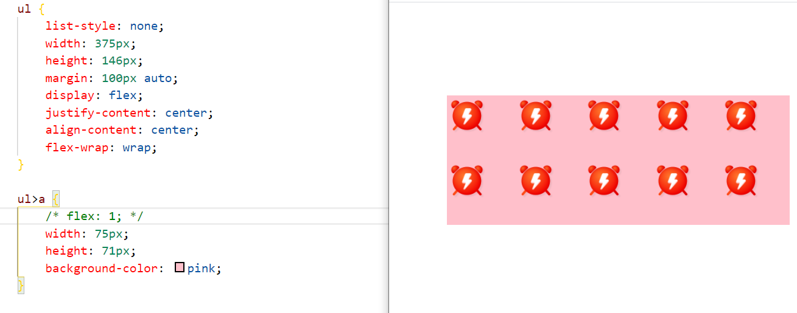
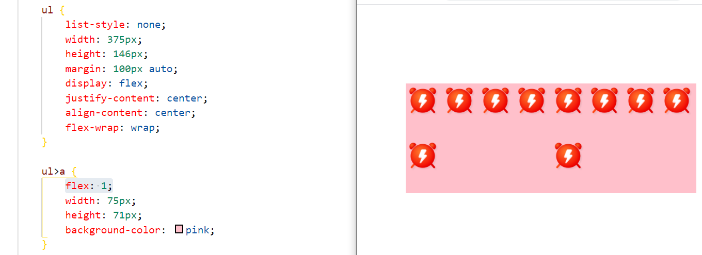

# 总结回顾30

## 学习内容

[黑马程序员pink老师前端入门教程，零基础必看的h5(html5)+css3+移动端前端视频教程_哔哩哔哩_bilibili](https://www.bilibili.com/video/BV14J4114768?p=541)

## 回顾所学内容

1. 响应式布局：

   * 响应式需要一个父级做为布局容器，来配合子级元素来实现变化效果。container容器。
   * 响应式开发原理：
     1. 就是使用媒体查询针对不同宽度的设备进行布局和样式的设置，从而适配不同设备的目的
   * 响应式尺寸划分：
     1. 超小屏幕（手机，小于 768px）：设置宽度为 100%
     2. 小屏幕（平板，大于等于 768px）：设置宽度为 750px
     3. 中等屏幕（桌面显示器，大于等于 992px）：宽度设置为 970px
     4. 大屏幕（大桌面显示器，大于等于 1200px）：宽度设置为 1170px 。
     5. 可根据自己定义和查阅文档如bootstrap中文网

2. bootstrap前端开发框架

   * 布局容器

     | 布局容器          | 描述                                                      |
     | ----------------- | --------------------------------------------------------- |
     | container类       | 响应式布局的容器 固定宽度；分屏媒体查询                   |
     | container-fluid类 | 流式布局容器 百分百宽度；占据全部视口（viewport）的容器。 |

   * 栅格系统

     1. 栅格系统用于通过一系列的行（row）与列（column）的组合来创建页面布局。

     2. 列嵌套：

        ```html
         <div class="col-sm-4">
             <div class="row">
             <div class="col-sm-6">小列</div>
             <div class="col-sm-6">小列</div>
             </div>
        </div>
        ```

     3. 列偏移：

        ```html
         <div class="row">
         <div class="col-lg-4">1</div>
         <div class="col-lg-4 col-lg-offset-4">2</div>
         </div>
        ```

     4. 列排列：

        ```html
        <div class="row">
         <div class="col-lg-4 col-lg-push-8">左侧</div>
         <div class="col-lg-8 col-lg-pull-4">右侧</div>
         </div>
        ```

     5. 响应式工具：

        1. 为了加快对移动设备友好的页面开发工作，利用媒体查询功能，并使用这些工具类可以方便的针对不同设备展示或隐藏页面内容。

3. 苏宁易购网页制作

## 问题

1. 弹性布局中子元素的份数如何划分。例如：

   

   我加了子项的份数之后

   

   所以这个份数如何确定呀！感觉这还是不懂。

