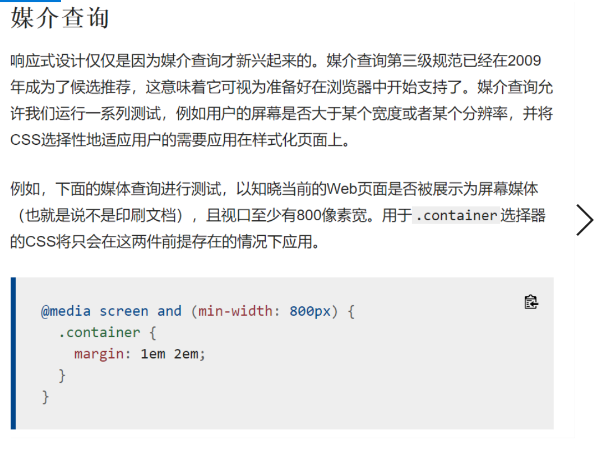
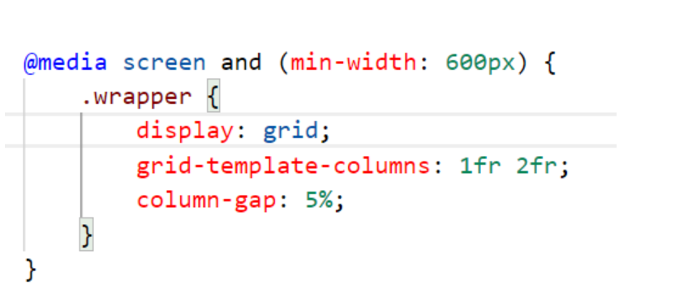
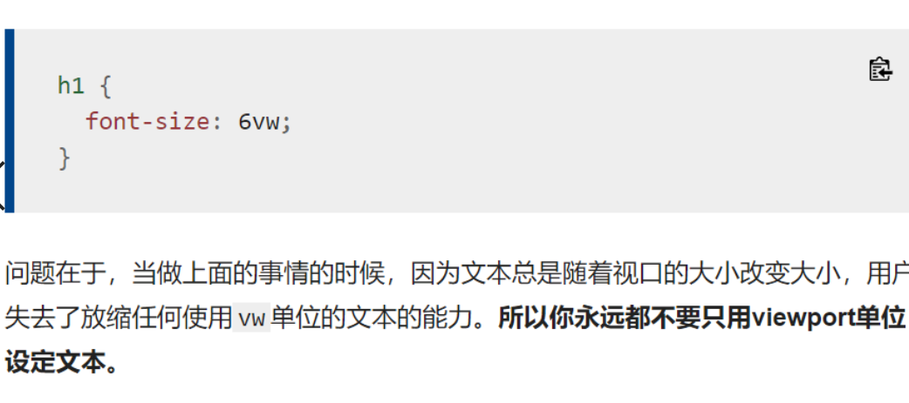

# 总结回顾12

## 学习进度

[Fundamental Layout Comprehension - 学习 Web 开发 | MDN (mozilla.org)](https://developer.mozilla.org/zh-CN/docs/Learn/CSS/CSS_layout/Fundamental_Layout_Comprehension)

## 回顾所学内容

1. 历史上的网站布局

   * 液态站点：液态站点导致了小屏幕上的设计会挤成一团（如下所示），以及大屏幕上难以阅读的很长的行长度。

   * 固定宽度站点：站点更窄的屏幕上会出现一个水平滚动条（如下所示），在大屏幕上的设计边缘还会有许多空白。

2. 响应式布局

   * 液态网格
   * 液态图像的理念：通过使用相当简单的将设置`max-width`属性设置为`100%`的技术。图像可以在包含它们的列变得比图像原始尺寸窄的时候，缩放得更小，但总不会变得更大。这使得图像可以被缩放，以被放到一个灵活尺寸的列，而不是溢出出去，同时也不会在列宽于图像的时候，使图像变得太大以至于画质变得粗糙。
   * 媒体查询。和所有尺寸的屏幕都使用一种布局不同的是，布局是可以改变的：侧栏可以在小屏幕上重新布局，而替代用的导航栏也可以显示出来。
   * 响应式web设计不是单独的技术，它是描述文本设计的一种方式，或者是一组最佳实践的一个词，它是用来建立可以响应查看内容的设备的样式的一个词。

3. 媒介查询：响应式设计仅仅是因为媒介查询才兴起来的。

   * 媒介查询允许我们运行一系列测试，例如用户的屏幕是否大于某个宽度或者某个分辨率，并将CSS选择性地适应用户的需要应用在样式化页面上。

4. 媒体查询：仅在浏览器和设备环境与您指定的规则匹配时，才能应用 CSS，例如"视图端口宽于 480 像素。"是响应式设计的关键组成部分，在CSS中使用@media规则，根据媒体查询的结果有条件地应用样式表的一部分。使用@import有条件地应用整个样式表。

   ```css
   @media media-type and (media-feature-rule) {
     /* CSS rules go here */
   }
   ```

   - 媒体类型，它告诉浏览器此代码用于何种媒体（例如打印或屏幕）。
   - 媒体表达式（这是一个规则）或必须通过的测试才能应用包含的 CSS。
   - 如果测试通过，并且媒体类型正确，将应用一组 CSS 规则。
   - 媒体类型可选：如果您在媒体查询中未指示媒体类型，则媒体查询将默认为适合所有媒体类型。

   ```css
   @media screen and (width: 600px) {
       body {
           color: red;
       }
   }
   /*视图端口宽度*/
   ```

   媒体查询的复杂查询

   * 媒体查询中的“与”逻辑，为了混合媒体特征
   * 媒体查询中的“或”逻辑，只需要两者中的一个匹配就可以执行css样式
   * 媒体查询中的“非”逻辑，和表达式相反的可执行

   怎么选择断点：

   什么是断点：引入媒体查询的点就叫做断点。

   

5. HTML中的媒体查询，可以应用到各种元素：a,img

6. 灵活网格

   * 灵活网格意味着你不需要适配每个可能使用的设备尺寸，然后为其建立一个精确到像素级的适配布局
   * 使用灵活网格，你只需要加进去一个断点，在内容看起来不齐整的时候改变设计。

7. 现代布局技术

   * 多栏布局，伸缩盒和网格默认是响应式的

   * 多个列：

     * 指定一个`column-count`的时候，这意指你希望把你的内容分成多少列。浏览器之后会算出这些列的大小，这是一个随着屏幕尺寸变化的尺寸。
     * 指定`column-width`的话，你是在指定一个*最小*宽度。浏览器会尽可能多数量地创建这一宽度的列，只要它们可以恰当地放进容器里面，然后将所有列之间的剩余空间共享出去。因而列的数量会随着空间的多少而改变

   * 伸缩盒

   * CSS网格

     

8. 响应式图像

   使用了picture元素和img元素和`srcset`和`sizes` 特性，解决了这两个问题。

9. 响应式排版：在移动端标题变小，在桌面端标题变大。

10. 视口元标签：

    ```css
    <meta name="viewport" content="width=device-width,initial-scale=1">
    
    ```

    这个元标签告诉移动端浏览器，它们应该将视口宽度设定为设备的宽度，将文档放大到其预期大小的100%，在移动端以你所希望的为移动优化的大小展示文档。

    - `initial-scale`：设定了页面的初始缩放，我们设定为1。
    - `height`：特别为视口设定一个高度。
    - `minimum-scale`：设定最小缩放级别。
    - `maximum-scale`：设定最大缩放级别。
    - `user-scalable`：如果设为`no`的话阻止缩放。

11. 使用视口单位实现响应式排版

    `1vw`等同于视口宽度的百分之一，即如果你用`vw`来设定字体大小的话，字体的大小将总是随视口的大小进行改变。

12. 传统布局
    * 两列布局
    * 固定宽度网络系统
    * 液态网络系统：长度固定，可把固定宽度转为伸缩的基于百分比宽度，做成弹性的网格
    * 语义 vs  “无语义”网格系统
    * 在网格里启用偏移容器
    * 浮动网格
    * 弹性盒网格
    * 第三方网格系统

13. 在旧浏览器中的的支持

    * 在css中构建回滚

      回滚方式：

      1. dispaly：inline-block;
      2. dispaly-table;
      3. Multi-col
      4. 弹性盒

    * 特性查询

    * 测试浏览器的途径

## 学习中碰到的问题

1. 作业中没能解决的问题：
   * 多列布局中，在无序列表之中，两行之间宽度的如何设置。
   * 定位在导航栏中的使用，

2. 媒介查询与媒体查询是什么？他们是一个意思吧

   

3. 什么是移动优先设计？

4. 什么是断点

5. 这一段的意思是什么？grid-temlate-columns属性（网格布局中列的数量）后面的四个值分别代表什么意思？column-gap（设置相邻两列之间间隙的宽度），后面的5%是什么意思？

6. 这句话中的用户失去了放缩任何使用vw单位的文本的能力，如何理解？

   

7. 如何设置浏览器网页为手机浏览尺寸？