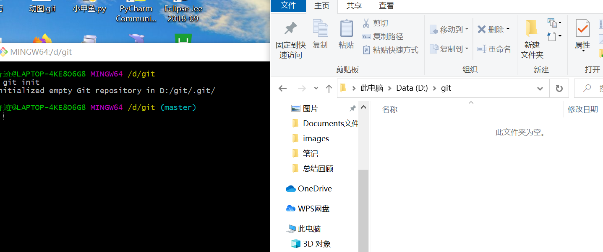
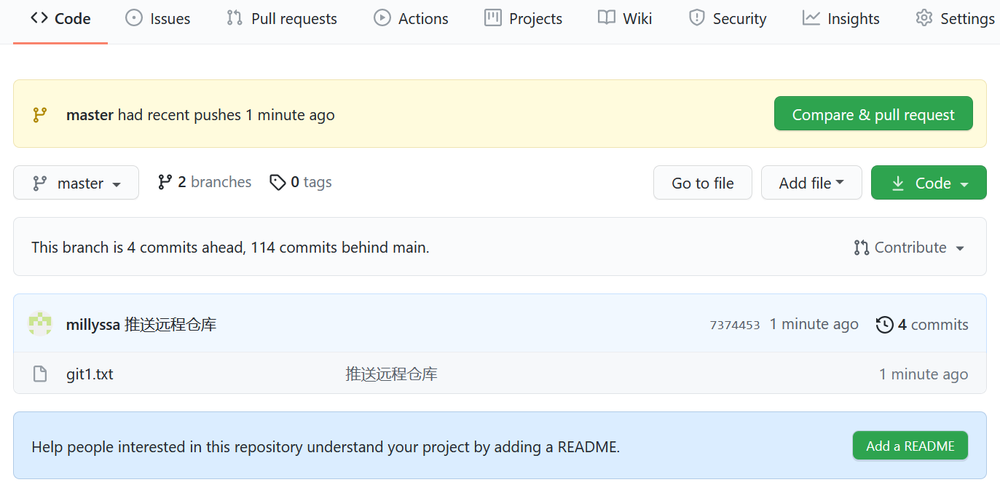
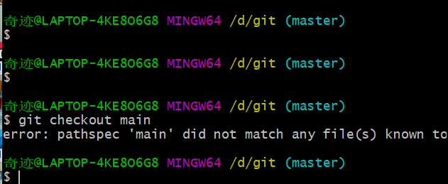

# 总结回顾16

## 学习内容

1. [黑马程序员html5+css3+移动web_前端入门教程，Web前端教程_零基础前端视频教程_哔哩哔哩_bilibili](https://www.bilibili.com/video/BV1pE411q7FU?p=249)

2. [3小时带你搞定git，玩转GitHub。让你在公司管理代码不再是问题【从入门到精通】java，前端，python，大数据项目代码管理_哔哩哔哩_bilibili](https://www.bilibili.com/video/BV1T54y1H7Lo?p=13)

## 回顾所学内容

1. 完成了浮动布局的案例

2. 定位

   * 将盒子定在某一个位置

   * 定位的组成：定位=定位模式+边偏移
   * 五种定位模式

   | 定位模式             | 是否脱离标准流 | 移动位置               |
   | -------------------- | -------------- | ---------------------- |
   | 静态定位（static）   | 否             | 不能使用边偏移         |
   | 相对定位（relative） | 否             | 相对自身位置偏移       |
   | 绝对定位（absolute)  | 是             | 相对于浏览器或父级偏移 |
   | 固定定位（fiexd）    | 是             | 相对于可视区窗口偏移   |
   | 粘性定位（sticky）   | 否             | 相对于可视区窗口偏移   |

   * 使用搭配：子绝父相;
   * 定位叠放次序z-index
     1. 产生的原因：在使用布局时，可能出现盒子重叠的情况。
     2. 使用 ：z-index：1；属性值越大那么在最顶层
     3. 注意：
        1. 数值可以是正整数，负数或0，默认是auto,数值越大，盒子越靠上。
        2. 属性值相同，则按照书写顺序，后来居上
        3. 只有定位的盒子才有 z-index属性

   * 定位的拓展

     绝对定位和固定定位类似

     1. 行内元素添加绝对或固定，可以直接设置高宽
     2. 块级元素添加绝对或固定，可以不给宽高，默认大小是内容的大小。

     浮动元素，绝对定位，固定定位元素都不会触发外边距合并的问题

   * 通过盒子模型，清楚知道大部分的HTML标签是一个盒子
   * 通过CSS浮动、定位可以让每个盒子排列成为网页。

   

## 元素的显示与隐藏

1. display属性用于设置一个元素如何显示

   * display：nono隐藏元素
   * display：block显示元素
   * 隐藏后不占用原来的位置

2. visibility可见性

   * visibility：visible:元素可视

   * visibility：hidden元素隐藏
   * 隐藏之后占有原来的位置

3. overflow溢出：overflow属性指定了如果内容溢出一个元素的框时，会发生什么

   | 属性值  | 描述                                   |
   | ------- | -------------------------------------- |
   | visible | 不剪切内容也不添加滚动条，可见         |
   | hidden  | 隐藏超出的部分                         |
   | scroll  | 不管超不超出都添加滚动条               |
   | auto    | 超出部分添加滚动条，不超出不显示滚动条 |

## 学习中遇到的问题

1. 没有隐藏的仓库

2. 我推送之后是多了一个master分支了

如何上传到main分支

