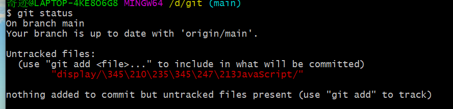

# 总结回顾18

## 学习内容

[JavaScript基础语法-dom-bom-js-es6新语法-jQuery-数据可视化echarts黑马pink老师前端入门基础视频教程(500多集)持续_哔哩哔哩_bilibili](https://www.bilibili.com/video/BV1Sy4y1C7ha?p=191)

## 回顾所学内容

1. 数组

   * 遍历数组：重头到尾访问一遍
   * 数组中新增元素的两种方法
     1. 可以通过改变length长度来实现数组扩容的目的
     2. 通过修改数组索引新增数组元素

   * 冒泡排序sort（）

     一种算法，可以实现数组的升序

2. 函数

   * 函数的封装：函数封装是一种函数的功能，将一个或多个能通过函数，类的方式封装起来，对外只提供一个简单的函数接口。

   * 函数就是封装了一段可以被重复执行调用的代码块 目的：就是让大量代码块重复使用

   * 函数的使用：函数的声明，函数的调用

   * 函数的参数：实参和形参

     | 参数个数             | 说明                    |
     | -------------------- | ----------------------- |
     | 实参个数等于形参个数 | 输出正确结果            |
     | 实参个数多于形参个数 | 只取到形参的个数        |
     | 实参个数小于形参个数 | 多的形参定义为undefined |

   * 函数的返回值

     1. return语句
        * 我们函数只是实现某种功能，最终的结果需要返回给函数的调用者函数名()通过return 实现的。
        * return终止函数
        * return只能返回一个值，但是为了输出多个值可以放在数组里，多个值会返回最后一个值。
        * 我们函数如果没有返回值，返回undefined

3. 对象

   1. 三种对象的创建
      * 利用字面量创建
      * 利用new Object创建
      * 利用构造函数

   2. 构造函数

      构造函数就是把我们对象里面一些相同的属性和方法抽1象出来封装到函数里面；封装对象的函数，它总于new运算符一起使用。

   3. new关键字

      它在执行时会做的四件事：

      1. 内存中中创建一个新的空对象
      2. 让this指向这个新的空对象
      3. 执行构造函数里面的代码，给这个新对象添加属性和方法
      4. 返回这个新对象（所以不需要return）。

   4. for...in语句用于对对象的属性进行循环操作。k返回的是属性名

   5. 对象复杂数据类型是object

4. 内置对象

   1. 查文档 ：developer.mozilla.org/zh-CN

   2. Math对象 ：Math数学对象 不是一个构造函数 所以我们不需要new 来调用 而是直接使用里面的属性和方法即可

   3. Date对象：Date()日期对象 是一个构造函数 必须使用new 来调用创建我们的日期对象

   4. Array对象：数组对象

      * instanceof 运算符 它可以用来检测是否为数组
      * Array.isArray(参数) H5 新增的方法 ie9以上版本

      | 数组对象  | 作用                                   |
      | --------- | -------------------------------------- |
      | push()    | 使用添加一个或多个，作用于数组的末尾   |
      | unshift() | 使用添加一个或多个，作用于数组的开头   |
      | pop()     | 删除数组的最后一个元素作用于数组的末尾 |
      | shift()   | 删除数组的最后一个元素作用于数组的开头 |

      1. 数组排序

         * 翻转数组 reverse（）

         * 冒泡排序 sort()

      2. 获取索引的方法

      3. indexOf

      4. 数组转换为字符

         | 方法名         | 作用                                       |
         | -------------- | ------------------------------------------ |
         | join('分隔符') | 方法用于把数组中的使用元素转换为一个字符串 |
         | toString()     | 把数组转换成字符串，逗号分隔每一项         |

   5. 字符串类型
      1. 基本包装类型：就是把简单数据类型 包装成了 复杂数据类型
      2. 字符串不可变：虽然看上去可以改变内容，但其实是地址变了，内存中新开辟了一个内存空间。
      3. 根据字符返回位置 ： indexOf
      4. 根据位置返回字符：charAt(index),chatCodeAt(index)获取指定位置的ASCII码，str[index]
      5. 拼接以及截取字符串
      6. 替换字符串以及转换为数组
      7. 转换大小写

   6. 简单数据类型和复杂数据类型

      1. 简单数据类型 是存放在栈里面 存放的是值

      2. 复杂数据类型 首先在栈里面存放地址 十六进制表示，然后这个地址指向堆里面的数据。

## 学习中所遇到的问题

1. 如何理解封装？
2. 

