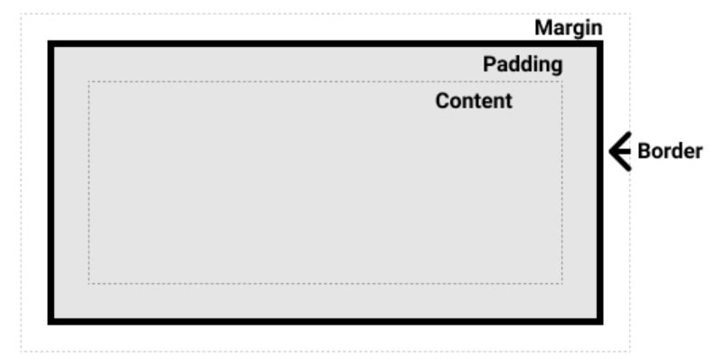
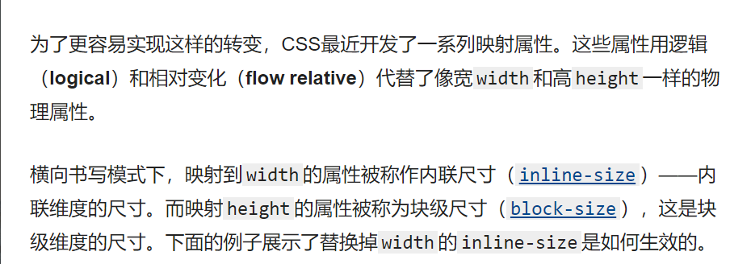
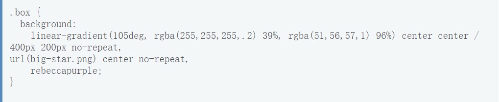

# 总结回顾7

## 学习进度

[处理不同方向的文本 - 学习 Web 开发 | MDN (mozilla.org)](https://developer.mozilla.org/zh-CN/docs/Learn/CSS/Building_blocks/Handling_different_text_directions)

## 回顾所学内容

1. 块级盒子内联盒子

2. 内部和外部显示类型

   * 外部显示类型：它决定盒子是块级还是内联。
   * 内部显示类型：它决定了盒子内部元素是如何布局的

3. 盒模型的各个部分

   

4. 标准盒模型

5. 替代（IE）盒模型

6. 外边距，内边距，外框

7. display: inline-block:它在内联和块之间提供了一个中间状态.使用它设置width 和height属性会生效，padding, margin，以及border会推开其他元素。

8. 背景颜色：background-color属性定义了CSS中任何元素的背景颜色，背景色扩展到元素的内容和内边距的下面

9. 背景图片：background-image属性允许在元素的背景中显示图像。

10. 控制背景平铺：background-repeat属性用于控制图像的平铺行为。

11. 调整背景图像的大小：backgroung-size它可以设置长度或百分比值，来调整图像的大小以适应背景

12. 背景图像定位background-position属性允许您选择背景图像显示在其应用到的盒子中的位置。默认的背景位置值是(0,0)。

13. 渐变背景的设置：

    ```cssbackground-image: linear-gradient(105deg, rgba(0,249,255,1) 39%, rgba(51,56,57,1) 96%);
    background-image: linear-gradient(105deg, rgba(0,249,255,1) 39%, rgba(51,56,57,1) 96%);

14. 多个背景图像：在单个属性值中指定多个background-image值，用逗号分隔每个值

    ```css
    background-image: url(image1.png), url(image2.png), url(image3.png), url(image1.png);
    ```

15. 背景附加:背景是指定他们如何滚动时，内容滚动。

    * scroll
    * fixed
    * local

16. 需要在简写背景属性时遵循的规则
17. 背景的可访问性考虑。
18. 边框圆角：border-radius属性和与方框的每个角相关的长边来实现方框的圆角。
19. 书写模式：是指文本的排列方向是横向还是纵向的。
20. 逻辑属性和逻辑值。

## 学习中遇到的困难

什么是linear-gradient（线性梯度 ）？



什么是映射属性？



